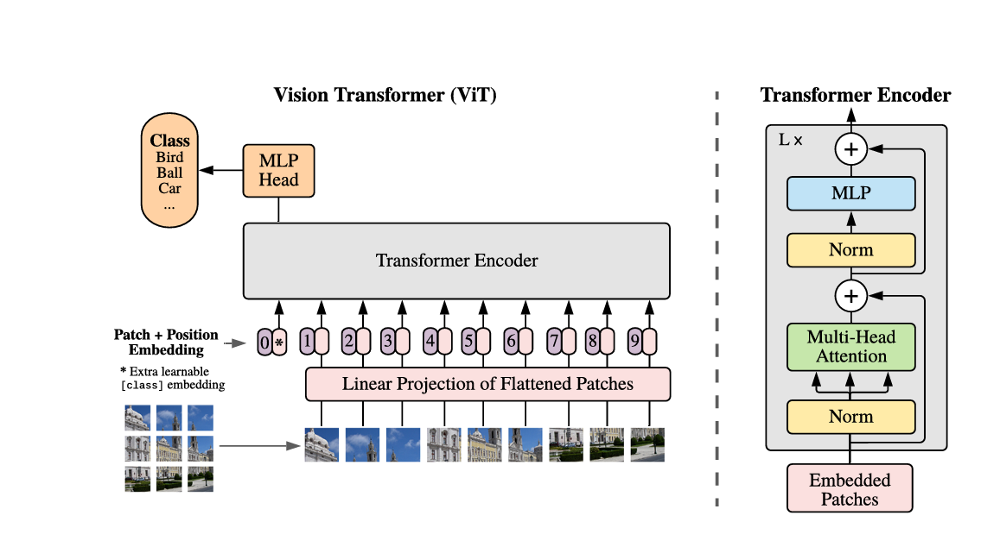

# Adversarial Attacks on Vision Transformers (ViT)

## Overview
This repository explores adversarial attacks specifically designed for Vision Transformers (ViT). Unlike traditional Convolutional Neural Networks (CNNs), attention-based models like ViT exhibit unique vulnerabilities that require specialized attack strategies.

## Motivation
Vision Transformers process images using self-attention mechanisms and patch-based representations, which differ fundamentally from the spatial hierarchies in CNNs. This architectural distinction creates new attack surfaces and requires adapted adversarial techniques.

---

## ViT Architecture

Vision Transformers follow a unique architecture that processes images as sequences of patches, fundamentally different from CNNs' convolution-based approach.



### Attack Surface in ViT

The attacks in this repository target two critical components of the Vision Transformer architecture:

1. **Image Patches (Token Level)**
   - Images are divided into fixed-size patches (e.g., 16×16)
   - Each patch is flattened and linearly projected to create patch embeddings
   - **Attack Strategy**: Perturbing specific patches can disrupt the model's understanding of spatial relationships

2. **Attention Blocks**
   - Multi-Head Self-Attention mechanisms compute relationships between all patches
   - Normalization layers and MLPs process attention outputs
   - **Attack Strategy**: Manipulating attention weights can cause the model to focus on irrelevant regions or ignore critical features

These two attack surfaces are leveraged by the adversarial methods described below, allowing targeted manipulation of ViT's patch-based representation and attention mechanisms.

---

## Attacks

### Attack 1: Dual-Stage Attack (PatchOut + PNA)

This attack combines two complementary techniques:
- **PatchOut**: Randomly selects and masks patches to identify vulnerable regions
- **PNA (Patch-wise Noise Addition)**: Applies gradient-based perturbations with L₂ normalization

#### Algorithm

**Input:** 
- Clean image $x$
- Maximum perturbation budget $\varepsilon$
- Number of iterations $I$
- Number of patches to select $T$

**Output:** 
- Adversarial example $x_{adv}$

**Procedure:**

```
1:  Initialize perturbation δ₀ ← 0
2:  Set step size α ← ε / I
3:  for i = 0 to I−1 do
4:      x_s ← PatchOut(x + δᵢ, T)           // Randomly select T patches
5:      M ← BuildPatchMask(x_s, T)          // Create patch-selection mask
6:      g ← PNA(∇_δ J(x + δᵢ, y_true))      // Compute gradient with L₂ normalization
7:      δᵢ₊₁ ← Clip_ε(δᵢ + α · sign(g))     // Update perturbation within [-ε, ε]
8:  end for
9:  x_adv ← x + δᵢ
10: return x_adv
```

#### Key Components

- **δ**: Adversarial perturbation added to the input image
- **α**: Step size controlling perturbation magnitude per iteration
- **PatchOut(x, T)**: Randomly masks T patches to focus attacks on vulnerable regions
- **M**: Binary mask indicating selected patches
- **PNA**: Patch-wise Noise Addition using normalized gradients
- **Clip_ε**: Ensures perturbation stays within $\ell_\infty$ bound $[-\varepsilon, \varepsilon]$

#### Parameters

| Parameter | Description | Typical Range |
|-----------|-------------|---------------|
| $\varepsilon$ | Maximum perturbation budget | 8/255 - 16/255 |
| $I$ | Number of iterations | 10 - 100 |
| $T$ | Number of patches to select | 10% - 30% of total patches |

---

## Repository Structure

```
Vit_Attacks/
├── README.md           # This file
├── Papers/            # Research papers and references
│   └── Attacks_on_Vit.pdf
├── src/               # Source code (to be added)
└── experiments/       # Experimental results (to be added)
```

---

## References

See `Papers/Attacks_on_Vit.pdf` for detailed technical background and analysis.

---

## Future Work

- [ ] Implementation of Attack 1
- [ ] Additional attack variants
- [ ] Comparative analysis with CNN attacks
- [ ] Defense mechanisms evaluation

---

## License

*To be added*
